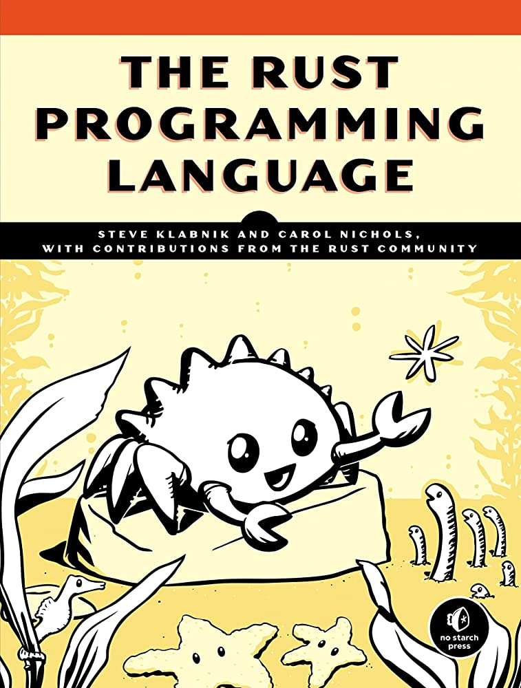

# "The Rust Programming Language"
**by Steve Klabnik and Carol Nichols, with contributions from the Rust Community** 

In this repository, I test all code that interests me from the Rust Book. 

If you find anything incorrect you can create an issue or open a pull request. 

These are my personal solutions, so only corrections are accepted. Solutions to missing exercises are not needed!  

**Rust Book: https://doc.rust-lang.org/stable/book/**

### Table of Contents
1. [Getting Started!](./01-Getting-Started)  
2. [Programming a Guessing Game](./02-Programming-a-Guessing-Game)  
3. [Common Programming Concepts](./03-Common-Programming-Concepts)  
4. [Understanding Ownership](./04-Understanding-Ownership)  
5. [Using Structs to Structure Related Data](./05-Structs)  
6. [Enums and Pattern Matching](./06-Enums-and-Pattern-Matching)  

**This repository is license free and redistributable.**  
**Not used commercially**